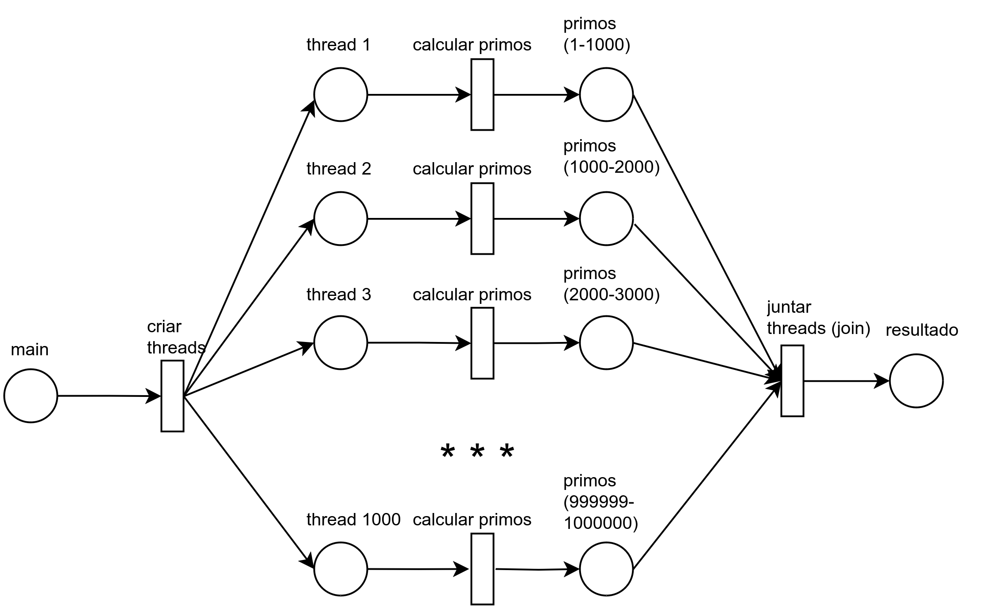

# Números primos entre 1 e 1.000.000 usando threads



## Desafio
Desenvolver um software que imprima os números
primos existentes entre 0 e 1.000.000. Utilize threads para cada faixa de 1000 valores crie uma
thread e dispare o processo para cada uma delas.

## Como rodar a solução (Linux/MacOS/WSL)
Certifique-se de que o `make` está instalado:

### Linux e WSL (Ubuntu/Debian)
``` bash
sudo apt update
sudo apt install make
```

### MacOS
``` zsh
brew install make
```

Agora, clone o repositório:
``` bash
git clone https://github.com/cloudywitt/AngeloGuilherme_ws_OS_RR_2024.git
```

Acesse-o:
``` bash
cd AngeloGuilherme_ws_OS_RR_2024
```

Compile e execute:
``` bash
make

# solução em paralelo
./bin/paralelo

# versão sequencial (singlethread), para comparações
./bin/sequencial
```

## Como rodar os testes
Acesse o diretório de testes:
``` bash
cd testes
```

Mude as permissões do script para torná-lo executável:
``` bash
chmod +x teste.sh
```

Execute:
``` bash
bash teste.sh
```

Em caso de erros, verifique se os códigos foram compilados (execute o `make`)
